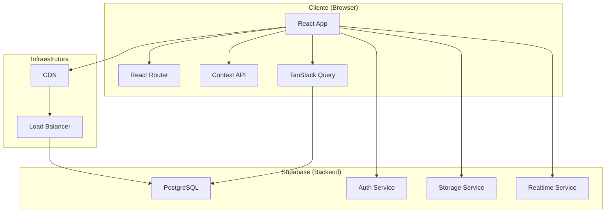
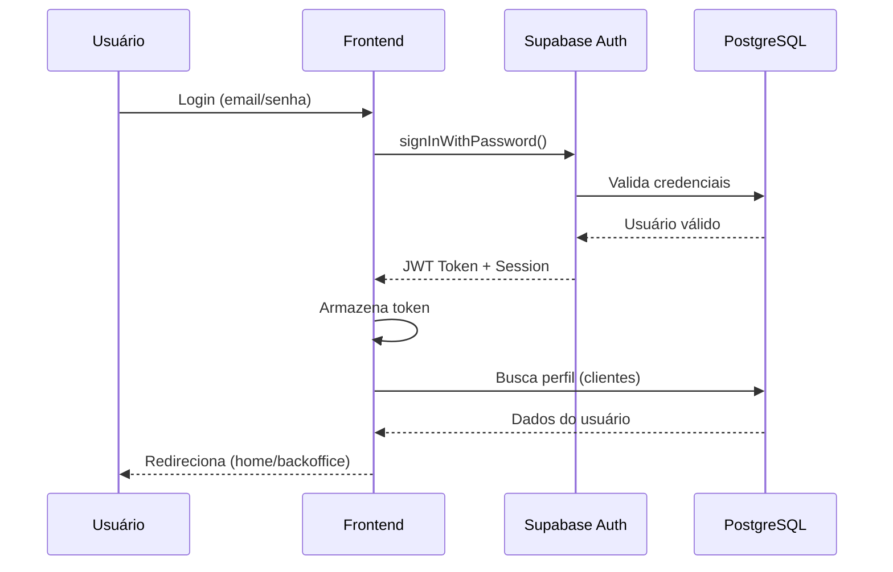
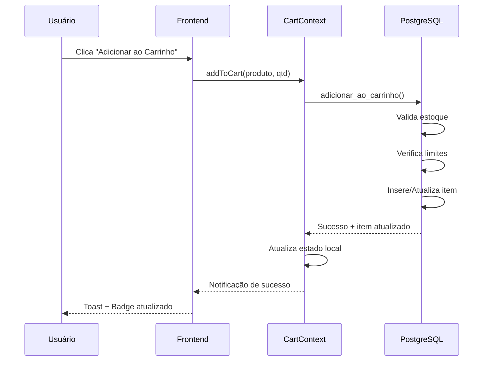
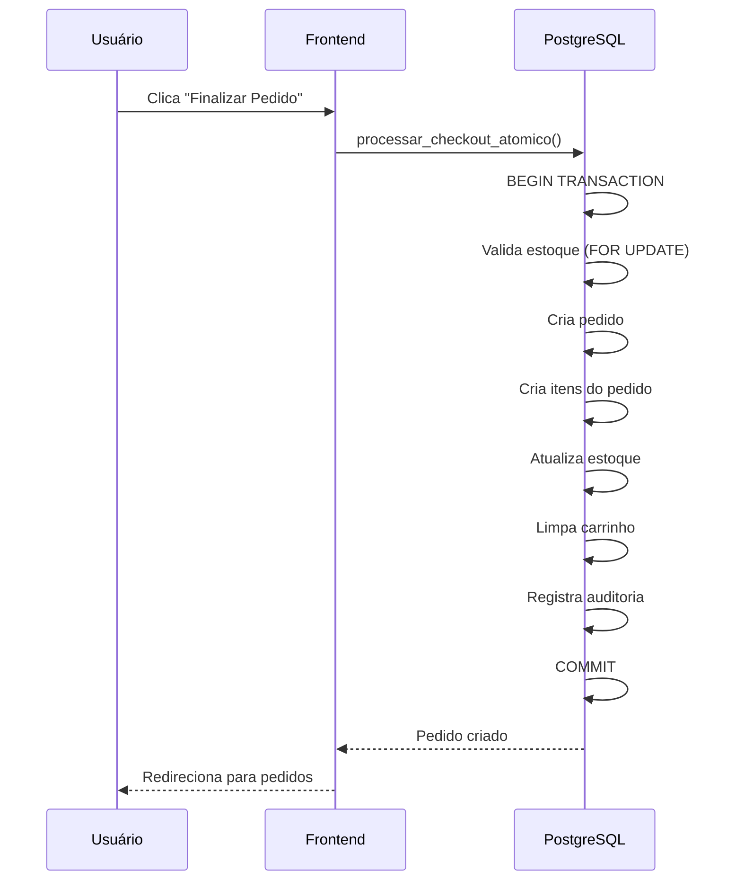

# 🏗️ Arquitetura do Sistema WaveSurf

**Conformidade**: Global Rules - Seção 4 (Arquitetura e Organização)  
**Data**: 05/11/2025  
**Versão**: 4.4.10

---

## 📋 Índice

1. [Visão Geral](#visão-geral)
2. [Arquitetura de Alto Nível](#arquitetura-de-alto-nível)
3. [Camadas da Aplicação](#camadas-da-aplicação)
4. [Fluxo de Dados](#fluxo-de-dados)
5. [Decisões Arquiteturais (ADRs)](#decisões-arquiteturais)
6. [Padrões Utilizados](#padrões-utilizados)
7. [Escalabilidade](#escalabilidade)

---

## 🎯 Visão Geral

WaveSurf segue uma arquitetura **Client-Server** moderna com:
- **Frontend SPA** (Single Page Application) em React
- **Backend BaaS** (Backend as a Service) via Supabase
- **Banco de Dados** PostgreSQL gerenciado
- **Autenticação** JWT via Supabase Auth
- **Storage** para imagens via Supabase Storage

---

## 🏛️ Arquitetura de Alto Nível



---

## 📦 Camadas da Aplicação

### 1. Camada de Apresentação (Frontend)

```
┌─────────────────────────────────────┐
│         PRESENTATION LAYER          │
├─────────────────────────────────────┤
│  Pages/                             │
│  ├── Index.tsx (Home)               │
│  ├── Login.tsx                      │
│  ├── Backoffice.tsx                 │
│  └── [16 páginas]                   │
├─────────────────────────────────────┤
│  Components/                        │
│  ├── Header, Footer, Hero           │
│  ├── Products, Cart                 │
│  └── ui/ (49 componentes)           │
└─────────────────────────────────────┘
```

**Responsabilidades**:
- Renderização de UI
- Interação com usuário
- Validação de formulários (client-side)
- Roteamento

### 2. Camada de Estado e Lógica de Negócio

```
┌─────────────────────────────────────┐
│       BUSINESS LOGIC LAYER          │
├─────────────────────────────────────┤
│  Contexts/                          │
│  ├── AuthContext                    │
│  └── CartContext                    │
├─────────────────────────────────────┤
│  Hooks/                             │
│  ├── useAuth                        │
│  ├── useOperationGuard              │
│  └── use-toast                      │
└─────────────────────────────────────┘
```

**Responsabilidades**:
- Gerenciamento de estado global
- Lógica de negócio do frontend
- Validações complexas
- Orquestração de operações

### 3. Camada de Dados (Backend/Supabase)

```
┌─────────────────────────────────────┐
│          DATA LAYER                 │
├─────────────────────────────────────┤
│  PostgreSQL Database                │
│  ├── 57 Tabelas                     │
│  ├── 68 Funções SQL                 │
│  ├── 22 Triggers                    │
│  └── 41 Políticas RLS               │
├─────────────────────────────────────┤
│  Supabase Services                  │
│  ├── Auth (JWT)                     │
│  ├── Storage (Imagens)              │
│  └── Realtime (WebSocket)           │
└─────────────────────────────────────┘
```

**Responsabilidades**:
- Persistência de dados
- Validações de integridade
- Lógica de negócio crítica (SQL)
- Segurança (RLS)
- Auditoria

---

## 🔄 Fluxo de Dados

### Fluxo de Autenticação



### Fluxo de Adicionar ao Carrinho



### Fluxo de Checkout



---

## 🎯 Decisões Arquiteturais (ADRs)

### ADR-001: Escolha do Supabase como Backend

**Status**: ✅ Aceito  
**Data**: 2025-01-15  
**Contexto**: Necessidade de backend robusto com autenticação, banco de dados e storage.

**Decisão**: Utilizar Supabase (PostgreSQL + Auth + Storage + Realtime)

**Consequências**:
- ✅ Redução de complexidade (sem servidor próprio)
- ✅ Autenticação pronta e segura
- ✅ RLS nativo do PostgreSQL
- ✅ Realtime sem WebSocket customizado
- ⚠️ Vendor lock-in moderado
- ⚠️ Custos escaláveis com uso

### ADR-002: React Context para Estado Global

**Status**: ✅ Aceito  
**Data**: 2025-01-15  
**Contexto**: Gerenciamento de estado de autenticação e carrinho.

**Decisão**: Usar React Context API + TanStack Query

**Consequências**:
- ✅ Simplicidade (sem Redux)
- ✅ TanStack Query para cache e sincronização
- ✅ Menos boilerplate
- ⚠️ Pode não escalar para estados muito complexos

### ADR-003: Carrinho Persistente no Banco

**Status**: ✅ Aceito  
**Data**: 2025-10-31  
**Contexto**: Carrinho em localStorage perdia dados e não sincronizava.

**Decisão**: Migrar carrinho para tabela `carrinho_itens` no PostgreSQL

**Consequências**:
- ✅ Sincronização entre dispositivos
- ✅ Não perde dados ao limpar cache
- ✅ Auditoria completa
- ✅ Validação de estoque em tempo real
- ⚠️ Mais queries ao banco

### ADR-004: shadcn/ui como Design System

**Status**: ✅ Aceito  
**Data**: 2025-01-15  
**Contexto**: Necessidade de componentes UI consistentes e acessíveis.

**Decisão**: Utilizar shadcn/ui (Radix UI + Tailwind)

**Consequências**:
- ✅ Componentes acessíveis (WCAG)
- ✅ Customizáveis via Tailwind
- ✅ Código copiado (não dependência)
- ✅ Tema consistente
- ⚠️ 49 componentes = bundle maior

---

## 🔨 Padrões Utilizados

### 1. Component Composition Pattern

```typescript
// Composição de componentes reutilizáveis
<Card>
  <CardHeader>
    <CardTitle>Título</CardTitle>
  </CardHeader>
  <CardContent>
    Conteúdo
  </CardContent>
</Card>
```

### 2. Custom Hooks Pattern

```typescript
// Encapsulamento de lógica reutilizável
const { user, isAdmin, logout } = useAuth();
const { addToCart, removeFromCart, cart } = useCart();
```

### 3. Context Provider Pattern

```typescript
// Estado global compartilhado
<AuthProvider>
  <CartProvider>
    <App />
  </CartProvider>
</AuthProvider>
```

### 4. Repository Pattern (SQL Functions)

```sql
-- Encapsulamento de lógica de dados
CREATE FUNCTION adicionar_ao_carrinho(
  p_user_id UUID,
  p_produto_id UUID,
  p_quantidade INTEGER
) RETURNS JSON;
```

### 5. Guard Pattern

```typescript
// Proteção de rotas
<AdminRoute>
  <Backoffice />
</AdminRoute>
```

---

## 📈 Escalabilidade

### Horizontal Scaling

**Supabase gerencia automaticamente**:
- ✅ Connection pooling (PgBouncer)
- ✅ Read replicas (planos pagos)
- ✅ CDN para assets estáticos

### Vertical Scaling

**Otimizações implementadas**:
- ✅ Índices em todas FK e queries frequentes
- ✅ Funções SQL para operações complexas
- ✅ Cache hit ratio: 99.87%
- ✅ Queries otimizadas (0.097ms média)

### Performance Targets

| Métrica | Target | Atual | Status |
|---------|--------|-------|--------|
| Time to First Byte | < 200ms | ~150ms | ✅ |
| First Contentful Paint | < 1.5s | ~1.2s | ✅ |
| Largest Contentful Paint | < 2.5s | ~2.1s | ✅ |
| Time to Interactive | < 3.5s | ~2.8s | ✅ |
| Cache Hit Ratio | > 95% | 99.87% | ✅ |

---

## 🔒 Segurança na Arquitetura

### Defense in Depth

```
┌─────────────────────────────────────┐
│  1. Frontend Validation (Zod)      │
├─────────────────────────────────────┤
│  2. API Gateway (Supabase)          │
├─────────────────────────────────────┤
│  3. JWT Validation                  │
├─────────────────────────────────────┤
│  4. Row Level Security (RLS)        │
├─────────────────────────────────────┤
│  5. Database Constraints            │
└─────────────────────────────────────┘
```

### Princípios Aplicados

- ✅ **Least Privilege**: RLS garante acesso mínimo necessário
- ✅ **Fail Secure**: Políticas RLS negam por padrão
- ✅ **Defense in Depth**: Múltiplas camadas de validação
- ✅ **Audit Trail**: Tabela `audit_logs` registra tudo

---

## 📚 Referências

- [Supabase Architecture](https://supabase.com/docs/guides/getting-started/architecture)
- [React Architecture Best Practices](https://react.dev/learn/thinking-in-react)
- [PostgreSQL Performance](https://www.postgresql.org/docs/current/performance-tips.html)
- Global Rules v12.0-llm - Seção 4

---

**Última Atualização**: 05/11/2025  
**Próxima Revisão**: Trimestral
