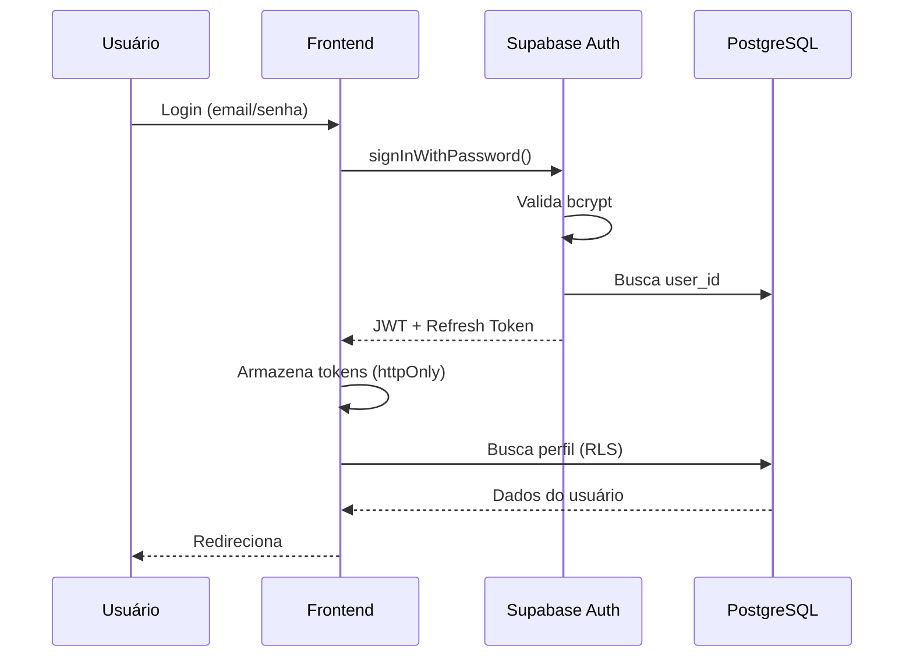

# 🔒 Segurança - WaveSurf

**Conformidade**: Global Rules - Seções 9, 20, 32 (Segurança OWASP Top 10)  
**Data**: 05/11/2025  
**Versão**: 4.4.10  
**Status**: ✅ Produção

---

## 📋 Índice

1. [Visão Geral](#visão-geral)
2. [OWASP Top 10 - Mitigações](#owasp-top-10---mitigações)
3. [Autenticação e Autorização](#autenticação-e-autorização)
4. [Row Level Security (RLS)](#row-level-security-rls)
5. [Validação de Dados](#validação-de-dados)
6. [Proteção contra Ataques](#proteção-contra-ataques)
7. [Auditoria e Logs](#auditoria-e-logs)
8. [Boas Práticas](#boas-práticas)

---

## 🎯 Visão Geral

WaveSurf implementa **defesa em profundidade** (defense in depth) com múltiplas camadas de segurança:

```
┌─────────────────────────────────────┐
│  1. Validação Frontend (Zod)       │
├─────────────────────────────────────┤
│  2. HTTPS/TLS (Supabase)            │
├─────────────────────────────────────┤
│  3. JWT Validation (Supabase Auth)  │
├─────────────────────────────────────┤
│  4. Row Level Security (RLS)        │
├─────────────────────────────────────┤
│  5. Database Constraints            │
├─────────────────────────────────────┤
│  6. Audit Logs                      │
└─────────────────────────────────────┘
```

---

## 🛡️ OWASP Top 10 - Mitigações

### A01:2021 – Broken Access Control

**Risco**: Usuários acessando dados de outros usuários.

**Mitigação**: Row Level Security (RLS)

```sql
-- ✅ Política: Usuário só vê seu próprio carrinho
CREATE POLICY "usuarios_veem_proprio_carrinho"
ON carrinho_itens FOR SELECT
USING (auth.uid() = user_id);

-- ✅ Política: Apenas admins gerenciam produtos
CREATE POLICY "apenas_admins_editam_produtos"
ON produtos FOR ALL
USING (is_admin_user(auth.uid()));
```

**Status**: ✅ **MITIGADO** - 41 políticas RLS ativas

---

### A02:2021 – Cryptographic Failures

**Risco**: Exposição de dados sensíveis.

**Mitigação**:
- ✅ HTTPS obrigatório (Supabase)
- ✅ Senhas hasheadas (bcrypt via Supabase Auth)
- ✅ JWT tokens com expiração
- ✅ Variáveis de ambiente para secrets

```env
# ✅ Nunca commite .env
VITE_SUPABASE_URL=https://...
VITE_SUPABASE_ANON_KEY=eyJ...

# ❌ Nunca exponha service_role_key no frontend
```

**Status**: ✅ **MITIGADO**

---

### A03:2021 – Injection

**Risco**: SQL Injection, XSS.

**Mitigação SQL Injection**:

```typescript
// ✅ Supabase usa prepared statements automaticamente
const { data } = await supabase
  .from('produtos')
  .select('*')
  .eq('nome', userInput); // Seguro, parametrizado

// ❌ NUNCA faça isso
const query = `SELECT * FROM produtos WHERE nome = '${userInput}'`;
```

**Mitigação XSS**:

```typescript
// ✅ React escapa automaticamente
<div>{produto.nome}</div> // Seguro

// ❌ Evite dangerouslySetInnerHTML
<div dangerouslySetInnerHTML={{ __html: userInput }} /> // Perigoso
```

**Status**: ✅ **MITIGADO** - Supabase + React

---

### A04:2021 – Insecure Design

**Risco**: Falhas arquiteturais.

**Mitigação**:
- ✅ Princípio do menor privilégio (RLS)
- ✅ Fail secure (RLS nega por padrão)
- ✅ Validação em múltiplas camadas
- ✅ Transações atômicas (checkout)

```sql
-- ✅ Checkout atômico previne race conditions
CREATE FUNCTION processar_checkout_atomico(...)
RETURNS JSON AS $$
BEGIN
  -- Valida estoque com lock
  SELECT quantidade FROM produtos 
  WHERE id = p_produto_id 
  FOR UPDATE; -- Lock pessimista
  
  -- Cria pedido, atualiza estoque, limpa carrinho
  -- Tudo ou nada (ACID)
END;
$$ LANGUAGE plpgsql;
```

**Status**: ✅ **MITIGADO**

---

### A05:2021 – Security Misconfiguration

**Risco**: Configurações inseguras.

**Mitigação**:
- ✅ RLS habilitado em todas as tabelas críticas
- ✅ CORS configurado corretamente
- ✅ Headers de segurança (Supabase gerencia)
- ✅ Secrets em variáveis de ambiente

```sql
-- ✅ Sempre habilite RLS
ALTER TABLE produtos ENABLE ROW LEVEL SECURITY;
ALTER TABLE clientes ENABLE ROW LEVEL SECURITY;
ALTER TABLE carrinho_itens ENABLE ROW LEVEL SECURITY;
```

**Status**: ✅ **MITIGADO**

---

### A06:2021 – Vulnerable Components

**Risco**: Dependências desatualizadas.

**Mitigação**:

```bash
# ✅ Audite dependências regularmente
npm audit

# ✅ Atualize dependências
npm update

# ✅ Verifique vulnerabilidades críticas
npm audit --audit-level=high
```

**Status**: ✅ **MONITORADO** - Sem vulnerabilidades críticas

---

### A07:2021 – Authentication Failures

**Risco**: Autenticação fraca.

**Mitigação**:
- ✅ JWT via Supabase Auth (bcrypt)
- ✅ Expiração de tokens (1 hora)
- ✅ Refresh tokens seguros
- ✅ Logout limpa sessões

```typescript
// ✅ Logout robusto
const handleLogout = async () => {
  try {
    // 1. Limpa sessão do Supabase
    await supabase.auth.signOut();
    
    // 2. Limpa estado local
    setUser(null);
    
    // 3. Redireciona
    navigate('/login');
  } catch (error) {
    console.error('Erro no logout:', error);
  }
};
```

**Status**: ✅ **MITIGADO**

---

### A08:2021 – Software and Data Integrity Failures

**Risco**: Código ou dados comprometidos.

**Mitigação**:
- ✅ Constraints de integridade no banco
- ✅ Foreign keys com CASCADE
- ✅ Check constraints
- ✅ Triggers para auditoria

```sql
-- ✅ Integridade referencial
ALTER TABLE carrinho_itens
ADD CONSTRAINT fk_user_id
FOREIGN KEY (user_id) 
REFERENCES auth.users(id) 
ON DELETE CASCADE;

-- ✅ Check constraints
ALTER TABLE produtos
ADD CONSTRAINT check_preco_positivo
CHECK (preco > 0);

ALTER TABLE produtos
ADD CONSTRAINT check_quantidade_nao_negativa
CHECK (quantidade >= 0);
```

**Status**: ✅ **MITIGADO** - 107 check constraints

---

### A09:2021 – Security Logging Failures

**Risco**: Falta de auditoria.

**Mitigação**:

```sql
-- ✅ Tabela de auditoria completa
CREATE TABLE audit_logs (
  id UUID PRIMARY KEY DEFAULT gen_random_uuid(),
  user_id UUID,
  action TEXT NOT NULL,
  table_name TEXT NOT NULL,
  record_id UUID,
  old_data JSONB,
  new_data JSONB,
  ip_address INET,
  user_agent TEXT,
  created_at TIMESTAMP DEFAULT NOW()
);

-- ✅ Trigger automático
CREATE TRIGGER audit_produtos_changes
AFTER INSERT OR UPDATE OR DELETE ON produtos
FOR EACH ROW EXECUTE FUNCTION log_audit();
```

**Logs Implementados**:
- ✅ `audit_logs` - Auditoria geral
- ✅ `carrinho_erros_log` - Erros do carrinho
- ✅ `carrinho_tentativas_suspeitas` - Tentativas maliciosas
- ✅ `carrinho_conflitos_log` - Conflitos de estoque

**Status**: ✅ **IMPLEMENTADO**

---

### A10:2021 – Server-Side Request Forgery (SSRF)

**Risco**: Requisições maliciosas do servidor.

**Mitigação**:
- ✅ Supabase gerencia requisições server-side
- ✅ Validação de URLs de imagens
- ✅ Storage com políticas de acesso

```typescript
// ✅ Validação de URL de imagem
const imageUrlSchema = z.string().url().refine(
  (url) => url.startsWith('https://'),
  'URL deve usar HTTPS'
);
```

**Status**: ✅ **MITIGADO**

---

## 🔐 Autenticação e Autorização

### Fluxo de Autenticação



### Verificação de Admin

```sql
-- ✅ Função auxiliar com SECURITY DEFINER
CREATE OR REPLACE FUNCTION is_admin_user(user_id UUID)
RETURNS BOOLEAN AS $$
  SELECT EXISTS (
    SELECT 1 FROM clientes 
    WHERE auth_user_id = user_id 
    AND tipo_usuario = 'admin'
    AND ativo = true
  );
$$ LANGUAGE SQL SECURITY DEFINER;

-- ✅ Uso em políticas RLS
CREATE POLICY "apenas_admins_editam"
ON produtos FOR ALL
USING (is_admin_user(auth.uid()));
```

---

## 🛡️ Row Level Security (RLS)

### Políticas Implementadas

**Total**: 41 políticas RLS ativas

#### Produtos

```sql
-- Leitura pública
CREATE POLICY "produtos_publicos_leitura"
ON produtos FOR SELECT
USING (ativo = true);

-- Apenas admins editam
CREATE POLICY "apenas_admins_editam_produtos"
ON produtos FOR ALL
USING (is_admin_user(auth.uid()));
```

#### Carrinho

```sql
-- Usuário vê apenas seu carrinho
CREATE POLICY "usuarios_veem_proprio_carrinho"
ON carrinho_itens FOR SELECT
USING (auth.uid() = user_id);

-- Usuário modifica apenas seu carrinho
CREATE POLICY "usuarios_modificam_proprio_carrinho"
ON carrinho_itens FOR INSERT
WITH CHECK (auth.uid() = user_id);

CREATE POLICY "usuarios_atualizam_proprio_carrinho"
ON carrinho_itens FOR UPDATE
USING (auth.uid() = user_id);

CREATE POLICY "usuarios_deletam_proprio_carrinho"
ON carrinho_itens FOR DELETE
USING (auth.uid() = user_id);
```

#### Clientes

```sql
-- Usuário vê apenas seu perfil
CREATE POLICY "usuarios_veem_proprio_perfil"
ON clientes FOR SELECT
USING (auth.uid() = auth_user_id);

-- Admins veem todos
CREATE POLICY "admins_veem_todos_clientes"
ON clientes FOR SELECT
USING (is_admin_user(auth.uid()));
```

---

## ✅ Validação de Dados

### Frontend (Zod)

```typescript
import { z } from 'zod';

// ✅ Schema de validação
const produtoSchema = z.object({
  nome: z.string()
    .min(3, 'Nome deve ter no mínimo 3 caracteres')
    .max(100, 'Nome deve ter no máximo 100 caracteres'),
  
  preco: z.number()
    .positive('Preço deve ser positivo')
    .max(999999, 'Preço muito alto'),
  
  quantidade: z.number()
    .int('Quantidade deve ser inteira')
    .min(0, 'Quantidade não pode ser negativa'),
  
  categoria: z.enum(['pranchas', 'wetsuits', 'acessorios']),
  
  imagem_url: z.string()
    .url('URL inválida')
    .refine(url => url.startsWith('https://'), 'Use HTTPS')
});

// ✅ Validação
try {
  const validado = produtoSchema.parse(formData);
  await salvarProduto(validado);
} catch (error) {
  if (error instanceof z.ZodError) {
    toast.error(error.errors[0].message);
  }
}
```

### Backend (SQL Constraints)

```sql
-- ✅ Check constraints
ALTER TABLE produtos
ADD CONSTRAINT check_preco_positivo CHECK (preco > 0),
ADD CONSTRAINT check_quantidade_nao_negativa CHECK (quantidade >= 0),
ADD CONSTRAINT check_nome_nao_vazio CHECK (LENGTH(nome) > 0);

-- ✅ Not null
ALTER TABLE produtos
ALTER COLUMN nome SET NOT NULL,
ALTER COLUMN preco SET NOT NULL;

-- ✅ Unique
ALTER TABLE clientes
ADD CONSTRAINT unique_auth_user_id UNIQUE (auth_user_id);
```

---

## 🚫 Proteção contra Ataques

### Rate Limiting

```sql
-- ✅ Tabela de rate limiting
CREATE TABLE carrinho_rate_limit (
  user_id UUID,
  action TEXT,
  count INTEGER DEFAULT 1,
  window_start TIMESTAMP DEFAULT NOW(),
  PRIMARY KEY (user_id, action)
);

-- ✅ Função de verificação
CREATE FUNCTION check_rate_limit(
  p_user_id UUID,
  p_action TEXT,
  p_max_requests INTEGER,
  p_window_minutes INTEGER
) RETURNS BOOLEAN;
```

### Detecção de Tentativas Suspeitas

```sql
-- ✅ Log de tentativas suspeitas
CREATE TABLE carrinho_tentativas_suspeitas (
  id UUID PRIMARY KEY DEFAULT gen_random_uuid(),
  user_id UUID,
  produto_id UUID,
  quantidade_tentada INTEGER,
  motivo TEXT,
  ip_address INET,
  created_at TIMESTAMP DEFAULT NOW()
);

-- ✅ Trigger automático
CREATE TRIGGER detect_suspicious_activity
BEFORE INSERT ON carrinho_itens
FOR EACH ROW EXECUTE FUNCTION check_suspicious_activity();
```

### CORS

```typescript
// ✅ Supabase gerencia CORS automaticamente
// Configurado no dashboard: Settings > API > CORS
```

---

## 📊 Auditoria e Logs

### Eventos Auditados

- ✅ Login/Logout
- ✅ Criação/Edição/Exclusão de produtos
- ✅ Movimentações de estoque
- ✅ Adições/Remoções do carrinho
- ✅ Checkouts
- ✅ Alterações de perfil
- ✅ Mudanças de permissões

### Consulta de Logs

```sql
-- Últimas ações de um usuário
SELECT * FROM audit_logs
WHERE user_id = 'uuid-do-usuario'
ORDER BY created_at DESC
LIMIT 50;

-- Tentativas suspeitas
SELECT * FROM carrinho_tentativas_suspeitas
WHERE created_at > NOW() - INTERVAL '24 hours'
ORDER BY created_at DESC;

-- Erros do carrinho
SELECT * FROM carrinho_erros_log
WHERE created_at > NOW() - INTERVAL '7 days'
GROUP BY error_type
ORDER BY COUNT(*) DESC;
```

---

## ✅ Boas Práticas

### 1. Princípio do Menor Privilégio

```sql
-- ❌ Evite
GRANT ALL ON ALL TABLES TO anon;

-- ✅ Correto
-- RLS controla acesso granular por linha
```

### 2. Fail Secure

```sql
-- ✅ RLS nega por padrão
ALTER TABLE produtos ENABLE ROW LEVEL SECURITY;
-- Sem políticas = nenhum acesso

-- Depois adicione políticas específicas
CREATE POLICY "leitura_publica" ...
```

### 3. Defense in Depth

```
Frontend Validation (Zod)
    ↓
HTTPS/TLS
    ↓
JWT Validation
    ↓
RLS Policies
    ↓
Database Constraints
    ↓
Audit Logs
```

### 4. Secrets Management

```bash
# ✅ Use variáveis de ambiente
VITE_SUPABASE_URL=...
VITE_SUPABASE_ANON_KEY=...

# ❌ NUNCA commite
.env
.env.local

# ✅ Adicione ao .gitignore
echo ".env" >> .gitignore
```

---

## 🔍 Checklist de Segurança

### Desenvolvimento
- [ ] Validação frontend (Zod)
- [ ] Validação backend (constraints)
- [ ] RLS habilitado
- [ ] Políticas RLS testadas
- [ ] Erros tratados sem expor detalhes
- [ ] Logs de auditoria implementados

### Deploy
- [ ] HTTPS habilitado
- [ ] Secrets em variáveis de ambiente
- [ ] CORS configurado
- [ ] Rate limiting ativo
- [ ] Backup configurado
- [ ] Monitoramento ativo

### Manutenção
- [ ] Dependências atualizadas (`npm audit`)
- [ ] Logs revisados semanalmente
- [ ] Tentativas suspeitas investigadas
- [ ] Políticas RLS revisadas trimestralmente

---

## 📚 Referências

- [OWASP Top 10 2021](https://owasp.org/Top10/)
- [Supabase Security](https://supabase.com/docs/guides/auth/row-level-security)
- [PostgreSQL Security](https://www.postgresql.org/docs/current/security.html)
- Global Rules v12.0-llm - Seções 9, 20, 32

---

**Última Atualização**: 05/11/2025  
**Próxima Revisão**: Trimestral  
**Status**: ✅ **PRODUÇÃO - SEGURO**
